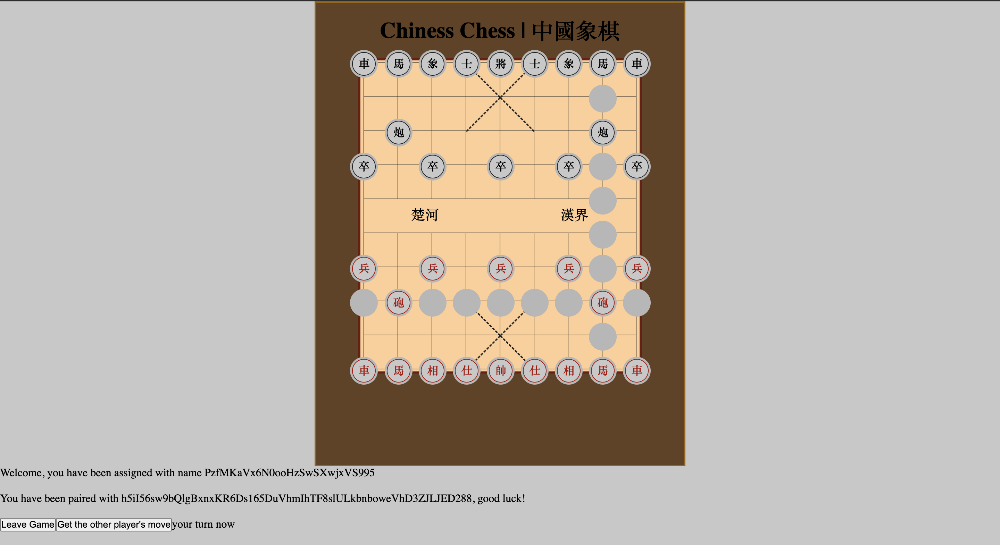
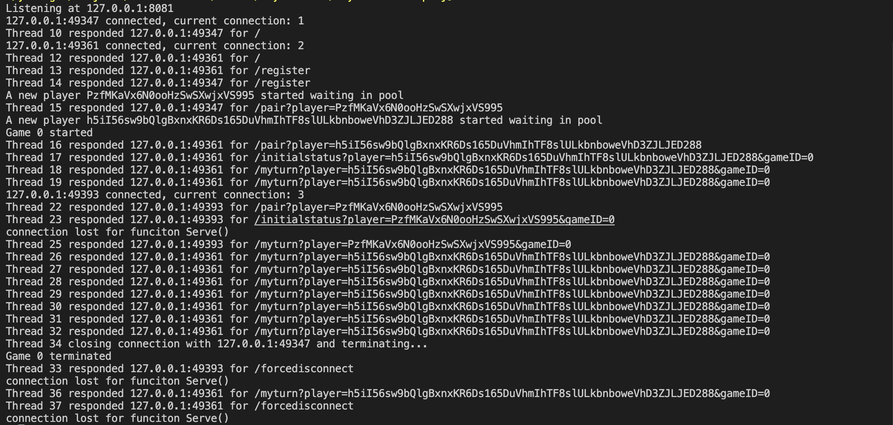

# Multiplayer Chinese-Chess Game

## Brief

This project is focused on implementing an asynchronous server which enables multiple browser-based clients to play a simple Chinese Chess game paired in 2. The server side only uses standard socket class of .Net 7 and implements a simplified HTTP-REST to handle the requests from clients.

## How to run

Clone this repository:

```
git clone https://github.com/Leo-Ma0502/Chinese-Chess.git
```

Start the server (.NET 7 runtime required):

```
cd Server/AsyncServer
dotnet run
```

Open the HTML file in two different browsers. In each window, click register and join the game.

## Web

Acknowledgement:
https://codepen.io/huangwei/pen/zqPbjY.
The online source code is mainly used for the chess board and chess style, and has been modified.


### What web client does:

a. Connect to server,

b. Receive updated state,

c. Receive invitation to move,

d. Confirm initiation to move and check the other’s move,

e. Move,

f. Back to step b.

## Server



### What server does:

a. Get players X and Y:

i. Confirm X connected,

ii. Confirm Y connected.

b. Confirm state,

c. Decide who is next (e.g. X),

d. Send alert to X,

e. Receive confirmation from X,

f. Receive update from X,

g. Back to step b, until one of players logs out.

## Endpoints for playing with the server only

```
/register

/pair?player={}

/ mymove?player={}&gameID={}&orow=${}&ocol=${}&nrow={}&ncol=${}&fac=${}&div=${}
//orow, ocol mean original row and column the chess was at,and nrow, ncol mean new row and column the chess will be at.

/theirmove?player={}&gameID={}

/myturn?player={}&gameID={}

/quit?player={}&gameID={}

/initialstatus?player={}&gameID={}
```
